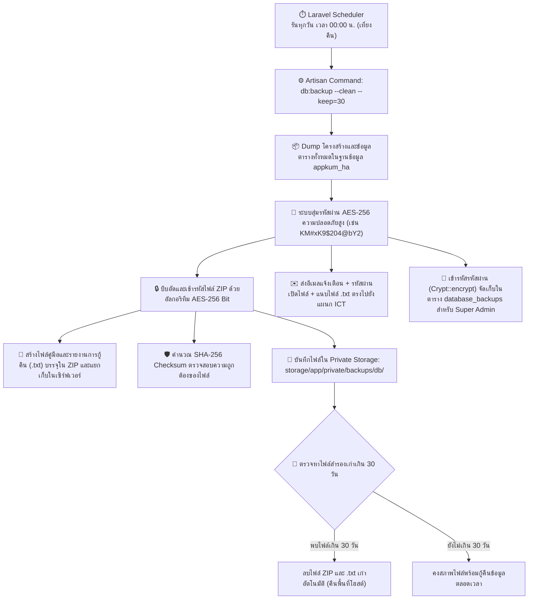

# คู่มือระบบสำรองฐานข้อมูลอัตโนมัติและการกู้คืนข้อมูล (Database Backup & Disaster Recovery Manual)
> **ระบบบริหารจัดการทรัพยากรบุคคล (Kumwell HR System)**  
> **ฐานข้อมูลเป้าหมายบนโฮสต์ (Target Database):** `appkum_ha`  
> **ความถี่การทำงาน (Schedule):** ทำงานอัตโนมัติทุกวัน เวลา 00:00 น. (เที่ยงคืน)  
> **มาตรฐานความปลอดภัย (Security):** เข้ารหัสไฟล์ ZIP ด้วยอัลกอริทึม **AES-256 Bit**, สุ่มรหัสผ่านส่งตรงเข้าอีเมล ICT, และเก็บไฟล์ใน **Private Storage** นาน 30 วัน  

---

## 1. ภาพรวมระบบ (System Overview)

ระบบสำรองฐานข้อมูลอัตโนมัติถูกออกแบบขึ้นเพื่อความต่อเนื่องทางธุรกิจ (Business Continuity) และการป้องกันข้อมูลสูญหาย (Disaster Recovery) ระดับองค์กร โดยมีคุณสมบัติหลัก:
1. **ทำงานอัตโนมัติ 100% (Zero-Touch Automation):** สำรองข้อมูลอัตโนมัติทุกวันตอนเที่ยงคืน (00:00 น.) ผ่าน Laravel Task Scheduler
2. **รองรับโฮสต์จริงทุกประเภท (Hosting-Ready):** ใช้เอนจิน **PDO Native Streaming** ไม่ต้องพึ่งพาโปรแกรมภายนอก (`mysqldump`) ทำให้ทำงานได้สมบูรณ์บน cPanel, DirectAdmin, Cloud VPS ทั้ง Linux และ Windows
3. **การเข้ารหัสระดับทหาร (Military-Grade AES-256 Encryption):** ไฟล์ `.zip` ถูกใส่รหัสผ่านและเข้ารหัสด้วยอัลกอริทึม AES-256 หากไม่มีรหัสผ่านจะไม่สามารถเปิดอ่านหรือแตกไฟล์ออกมาได้เด็ดขาด
4. **สุ่มรหัสผ่านอัตโนมัติ (High-Entropy Random Password):** รหัสผ่านถูกสุ่มขึ้นใหม่ในแต่ละวัน ไม่ซ้ำกัน ป้องกันการคาดเดา (Brute-force)
5. **จัดส่งรหัสผ่านตรงเข้าสู่อีเมลแผนก ICT (Automated ICT Dispatch):** ทันทีที่การสำรองเสร็จสมบูรณ์ ระบบจะส่งอีเมลแจ้งเตือนพร้อมรหัสผ่านเปิดไฟล์ และแนบเอกสารคู่มือ `.txt` ไปยังทีม ICT
6. **การจัดเก็บแยกส่วนปลอดภัย (Private Storage Isolation):** จัดเก็บไฟล์ที่ `storage/app/private/backups/db/` อยู่นอก `public_html` บุคคลภายนอกไม่สามารถเข้าถึงผ่าน URL ได้
7. **นโยบายการหมุนเวียนไฟล์ 30 วัน (30-Day Retention Policy):** ตรวจสอบและลบไฟล์สำรองเก่าที่เกิน 30 วันออกอัตโนมัติ เพื่อประหยัดพื้นที่ดิสก์บนโฮสต์

---

## 2. แผนผังการทำงานของระบบ (Workflow Diagram)



---

## 3. รูปแบบการตั้งชื่อไฟล์ (Naming Conventions)

ระบบจะสร้างไฟล์สำรองโดยอ้างอิงชื่อฐานข้อมูล `appkum_ha` และวันเวลาที่สำรองข้อมูล:

| ชนิดไฟล์ | โครงสร้างชื่อไฟล์ | ตัวอย่างชื่อไฟล์จริง |
| :--- | :--- | :--- |
| **ไฟล์สำรองบีบอัด (Encrypted ZIP)** | `backup_db_{DATABASE}_{YYYYMMDD_HHIISS}.zip` | `backup_db_appkum_ha_20260930_000000.zip` |
| **ไฟล์คู่มือประกอบ (.txt Guide)** | `backup_db_{DATABASE}_{YYYYMMDD_HHIISS}_README.txt` | `backup_db_appkum_ha_20260930_000000_README.txt` |
| **ไฟล์ฐานข้อมูลภายใน ZIP** | `database_{DATABASE}_{YYYYMMDD_HHIISS}.sql` | `database_appkum_ha_20260930_000000.sql` |
| **ไฟล์คู่มือภายใน ZIP** | `README.txt` | คู่มือการถอดรหัสและกู้คืน (เปิดด้วย Notepad ได้ทันที) |
| **ไฟล์ Manifest ภายใน ZIP** | `manifest.json` | ข้อมูลตาราง, สถิติ, วันเวลา และสถานะการเข้ารหัส |

---

## 4. มาตรการความปลอดภัยและการเข้ารหัส (Security Specifications)

### 4.1 อัลกอริทึม AES-256 Bit Encryption
- ไฟล์ข้อมูล SQL ภายใน ZIP ถูกเข้ารหัสด้วยฟังก์ชัน `ZipArchive::EM_AES_256`
- การทดสอบยืนยัน:
  - หากแตกไฟล์ **โดยไม่ใส่รหัสผ่าน** หรือ **ใส่รหัสผ่านผิด** = **ได้ข้อมูลขนาด 0 Byte** (Access Denied)
  - ใส่รหัสผ่านถูกต้องจากอีเมล ICT = **แตกข้อมูลครบถ้วน 100%**

### 4.2 การสุ่มรหัสผ่าน (Random Key Generation)
- สร้างขึ้นจากตัวอักษรพิมพ์ใหญ่, พิมพ์เล็ก, ตัวเลข และอักขระพิเศษ (เช่น `KM#yU8$942@zK1`)
- ความยาว 16-20 ตัวอักษรที่มีค่า Entropy สูง ป้องกันการแฮกหรือถอดรหัสด้วยคอมพิวเตอร์ความเร็วสูง

### 4.3 การจัดเก็บรหัสผ่านในฐานข้อมูล
- รหัสผ่านที่เก็บในตาราง `database_backups` จะถูกเข้ารหัสสองชั้นด้วย Laravel Application Key (`Crypt::encryptString($plainPassword)`)
- ไม่มีใครสามารถดูรหัสผ่านเป็นตัวอักษรธรรมดาได้จากหน้าจัดการฐานข้อมูล phpMyAdmin

---

## 5. การตั้งค่าบนโฮสต์จริง (Hosting Deployment Guide)

### 5.1 การตั้งค่าไฟล์ `.env` บนโฮสต์
ตรวจสอบการตั้งค่าในไฟล์ `.env` บนเซิร์ฟเวอร์โฮสต์:
```env
# ข้อมูลฐานข้อมูลบนโฮสต์
DB_CONNECTION=mysql
DB_HOST=localhost
DB_PORT=3306
DB_DATABASE=appkum_ha
DB_USERNAME=ชื่อผู้ใช้งานฐานข้อมูลโฮสต์
DB_PASSWORD=รหัสผ่านฐานข้อมูลโฮสต์

# อีเมลแผนก ICT สำหรับรับรหัสผ่านถอดรหัส AES-256
ICT_BACKUP_EMAIL=ict@kumwell.com

# การตั้งค่าระบบเมลสำหรับส่งรหัสผ่าน
MAIL_MAILER=smtp
MAIL_HOST=smtp.office365.com
MAIL_PORT=587
MAIL_USERNAME=noreply@kumwell.com
MAIL_PASSWORD=your_mail_password
MAIL_ENCRYPTION=tls
MAIL_FROM_ADDRESS="noreply@kumwell.com"
MAIL_FROM_NAME="Kumwell HR System"
```

### 5.2 การตั้งค่า Cron Job บนโฮสต์ (cPanel / DirectAdmin / Linux Crontab)
เพื่อให้ระบบสำรองข้อมูลตอนเที่ยงคืน (00:00 น.) ทำงานตรงเวลา ให้เพิ่มคำสั่ง Cron Job บนโฮสต์ให้รันทุก 1 นาที:
```bash
* * * * * cd /home/username/public_html && php artisan schedule:run >> /dev/null 2>&1
```
*(ระบบจะตรวจจับเวลาเที่ยงคืน 00:00 น. และสั่งคำสั่ง `db:backup --clean --keep=30` ให้ทำงานอัตโนมัติ)*

---

## 6. คู่มือขั้นตอนการถอดรหัสและกู้คืนข้อมูล (Disaster Recovery Manual)

เมื่อเกิดเหตุฉุกเฉินและต้องการนำไฟล์สำรองมาใช้งาน ให้ปฏิบัติตามขั้นตอนดังนี้:

### ขั้นตอนที่ 1: รับรหัสผ่านจากอีเมลแผนก ICT
1. ค้นหาอีเมลจากระบบ หัวข้อ: `🔒 [Kumwell ICT] รหัสผ่านสำรองฐานข้อมูลประจำวัน (AES-256) - backup_db_appkum_ha_...zip`
2. คัดลอกรหัสผ่านในกล่อง **"AES-256 Decryption Password"**
*(หมายเหตุ: หากอีเมลติด Spam หรือส่งไม่สำเร็จ แอดมินสามารถล็อกอินเข้าระบบเว็บและคลิกปุ่ม **"รหัสผ่าน"** เพื่อคัดลอกรหัสผ่านได้เช่นกัน)*

### ขั้นตอนที่ 2: การถอดรหัสและแตกไฟล์ (Decryption)

#### กรณีใช้งานบน Windows (ผ่านโปรแกรม 7-Zip / WinRAR):
1. คลิกขวาที่ไฟล์ `backup_db_appkum_ha_YYYYMMDD_HHIISS.zip`
2. เลือก **7-Zip** -> **Extract files...** (หรือ Extract Here)
3. ระบบจะแสดงกล่องข้อความ **Enter password**
4. วางรหัสผ่านที่ได้รับจากอีเมล ICT และกด **OK**
5. ท่านจะได้ไฟล์ `database_appkum_ha_YYYYMMDD_HHIISS.sql` พร้อมใช้งานทันที

#### กรณีใช้งานบน Linux / Cloud VPS (ผ่าน Command Line):
```bash
# วิธีที่ 1: ใช้โปรแกรม 7z (แนะนำ)
7z x -p"รหัสผ่านที่ได้จากอีเมล" backup_db_appkum_ha_20260930_000000.zip

# วิธีที่ 2: ใช้คำสั่ง unzip
unzip -P "รหัสผ่านที่ได้จากอีเมล" backup_db_appkum_ha_20260930_000000.zip
```

### ขั้นตอนที่ 3: การกู้คืนฐานข้อมูลเข้าสู่ MySQL (Database Import)
เมื่อได้ไฟล์ `.sql` แล้ว สามารถนำเข้าข้อมูลด้วยคำสั่ง:
```bash
# คำสั่ง Import ฐานข้อมูลผ่าน Command Line บนโฮสต์
mysql -h localhost -u [DB_USERNAME] -p appkum_ha < database_appkum_ha_20260930_000000.sql
```
หรือนำเข้าผ่านเมนู **Import** บนหน้า **phpMyAdmin** ของโฮสต์ได้เช่นกัน

### ขั้นตอนที่ 4: การตรวจสอบความสมบูรณ์ของไฟล์ (Integrity Check)
ก่อนนำไฟล์ไปใช้งาน สามารถตรวจสอบค่า SHA-256 Checksum เพื่อยืนยันว่าไฟล์ไม่ถูกดัดแปลง:
```powershell
# บน Windows PowerShell
Get-FileHash -Algorithm SHA256 backup_db_appkum_ha_20260930_000000.zip

# บน Linux / macOS
sha256sum backup_db_appkum_ha_20260930_000000.zip
```

---

## 7. คำสั่ง Artisan CLI Command สำหรับผู้ดูแลระบบ

ผู้ดูแลระบบสามารถทดสอบหรือสั่งการสำรองข้อมูลด้วยตนเองผ่าน Terminal:

```powershell
# 1. สำรองข้อมูลทันที พร้อมล้างไฟล์เก่าเกิน 30 วัน
php artisan db:backup --clean

# 2. สำรองข้อมูลโดยกำหนดระยะเวลาเก็บรักษาเจาะจง (เช่น เก็บ 60 วัน)
php artisan db:backup --clean --keep=60

# 3. ตรวจสอบตารางงานอัตโนมัติ (Schedule List)
php artisan schedule:list
```

---

## 8. หน้าจอจัดการบน Web Dashboard สำหรับ Admin

เข้าใช้งานได้ที่เมนู: **System Settings -> สำรองฐานข้อมูล (DB Backups)** (URL: `/backend/database-backups`)

- **การ์ดสถิติ (Stat Cards):** แสดงจำนวนไฟล์สำรองทั้งหมด, พื้นที่ดิสก์ที่ใช้, สถานะรันอัตโนมัติเที่ยงคืน, และข้อมูลสำรองล่าสุด
- **ปุ่ม "สำรองฐานข้อมูลทันที (Backup Now)":** กดสำรองข้อมูลฉุกเฉินได้ทันทีก่อนอัปเดตระบบ
- **ปุ่ม "ล้างไฟล์เกิน 30 วัน":** กดทำความสะอาดไฟล์หมดอายุได้ทันที
- **ปุ่ม "โหลด ZIP":** ดาวน์โหลดไฟล์ ZIP ที่เข้ารหัสลงเครื่องคอมพิวเตอร์
- **ปุ่ม "คู่มือ .txt":** ดาวน์โหลดเอกสารคู่มือการกู้คืน (.txt) เปิดด้วย Notepad ได้ทันที
- **ปุ่ม "รหัสผ่าน":** แสดงหน้าต่าง Pop-up แสดงรหัสผ่าน AES-256 สำหรับผู้ดูแลระบบ (พร้อมระบบบันทึก Audit Log การเปิดดูเพื่อความโปร่งใส)

---

## 9. ตารางและไฟล์ที่เกี่ยวข้องในโค้ด (Source Code Reference)

| ไฟล์โค้ด | หน้าที่และการทำงาน |
| :--- | :--- |
| [app/Services/DatabaseBackupService.php](file:///c:/xampp/htdocs/ha-project/app/Services/DatabaseBackupService.php) | คลาสหลักในการดัมป์ MySQL, เข้ารหัส AES-256, สร้าง `.md`, ส่งอีเมล ICT, และลบไฟล์เก่า 30 วัน |
| [app/Console/Commands/DatabaseBackupCommand.php](file:///c:/xampp/htdocs/ha-project/app/Console/Commands/DatabaseBackupCommand.php) | คำสั่ง Artisan `db:backup` สำหรับรันผ่าน CLI หรือ Task Scheduler |
| [routes/console.php](file:///c:/xampp/htdocs/ha-project/routes/console.php) | กำหนดเวลารันอัตโนมัติทุกวันตอนเที่ยงคืน (`dailyAt('00:00')`) |
| [app/Http/Controllers/Backend/DatabaseBackupController.php](file:///c:/xampp/htdocs/ha-project/app/Http/Controllers/Backend/DatabaseBackupController.php) | คอนโทรลเลอร์ควบคุมหน้าเว็บ, ดาวน์โหลด ZIP/.md, และเปิดดูรหัสผ่าน |
| [resources/views/backend/database-backups/index.blade.php](file:///c:/xampp/htdocs/ha-project/resources/views/backend/database-backups/index.blade.php) | หน้าจอแดชบอร์ดบริหารจัดการไฟล์สำรองฐานข้อมูล |
| [app/Models/DatabaseBackup.php](file:///c:/xampp/htdocs/ha-project/app/Models/DatabaseBackup.php) | Model ฐานข้อมูลบันทึกประวัติ, สถานะเข้ารหัส, และฟังก์ชันถอดรหัสรหัสผ่าน |

---
*จัดทำขึ้นสำหรับ: แผนกเทคโนโลยีสารสนเทศ (ICT Department) และทีมผู้ดูแลระบบ Kumwell HR System*
